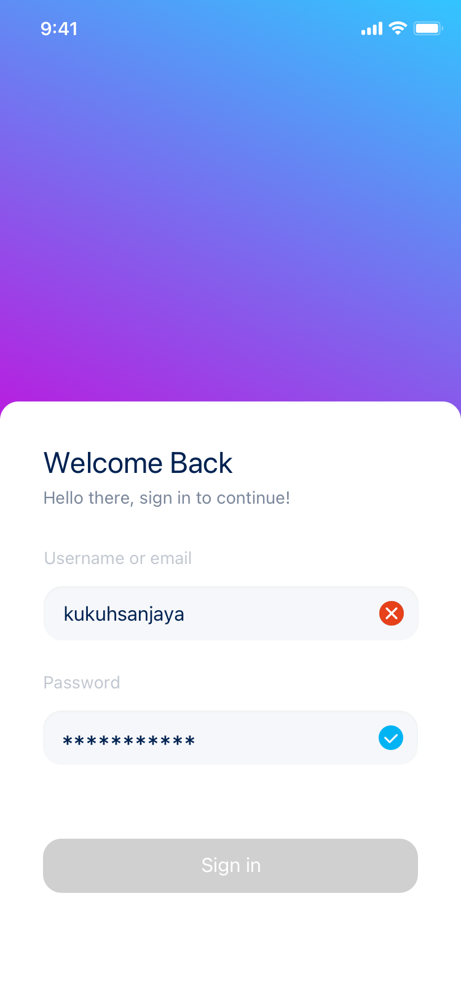
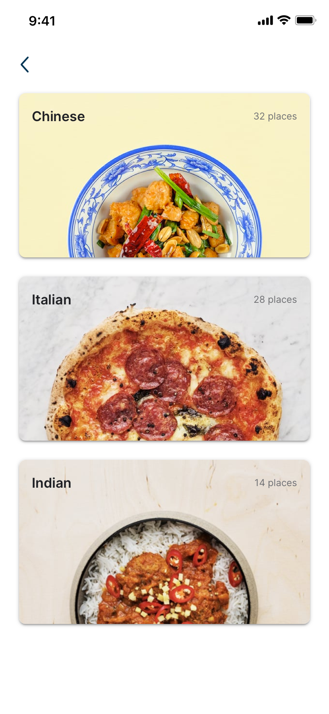
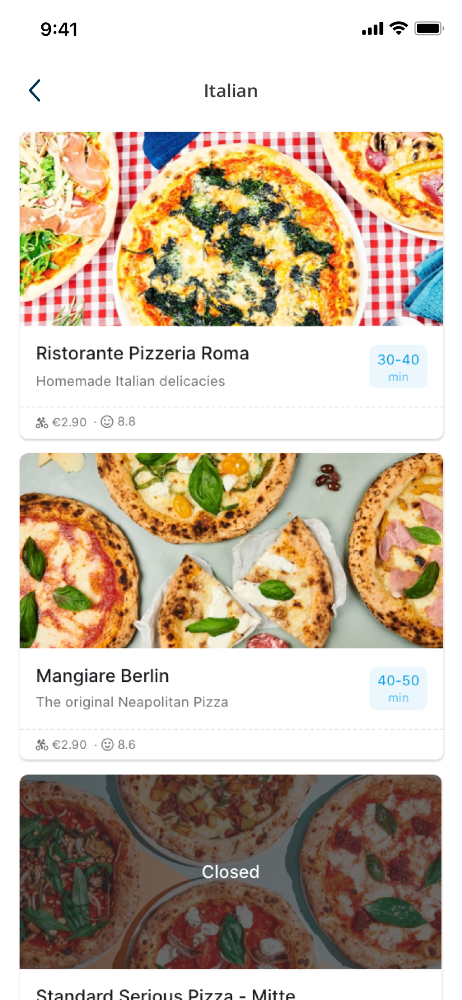
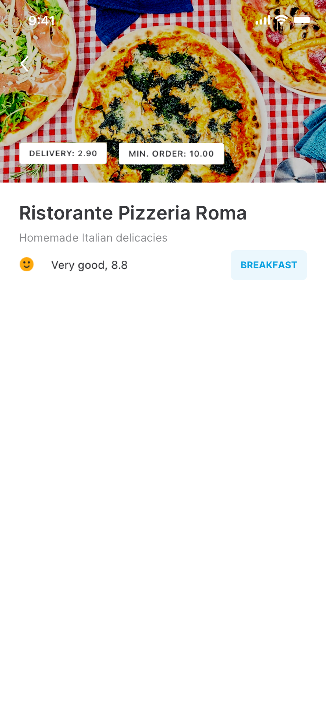

# Intro

Dear Candidate,

First of all, congratulations on making it to this stage! 🥳 The fact that you are reading this means you’ve reached the Tech Challenge Phase—an impressive milestone in our process! 🎉 This puts you halfway through the journey to joining our team. 😎

Below, you will find detailed instructions for the Tech Challenge. This is your moment to shine, and we are excited to see what you can bring to the table!

## Challenge Overview

Imagine we outsourced the development of an application called `RaisinEat`, but midway through the project, the developer had to step away due to unforeseen circumstances. The repository we’ve shared contains the incomplete codebase we received. Your challenge is to resolve the issues and complete the project.

## Project requirements

1. **Splash Screen**: The app begins with a shiny splash screen.  ✨ [See Detail](#splash-screen)
2. **Login Screen**: Users can log in with their email and password. [See Detail](#login-screen)
3. **Cuisine List Screen**: Users see a list of `Cuisines` after logging in. 🍲 [See Detail](#cuisine-list-screen)
4. **Restaurant List Screen**: Clicking on a `Cuisine` shows `Restaurants` for that `Cuisine`. Open restaurants are listed first, followed by closed ones. 🧑‍🍳 [See Detail](#restaurant-list-screen)
5. **Restaurant Detail Screen**: Clicking on a `Restaurant` shows its detailed information. [See Detail](#restaurant-detail-screen)

## Feature Specifications

### Splash screen

- The design of the splash screen is up to your imagination.
- Use any relevant online image or assets that suit the app theme.

### Login screen

- The screen includes:
  - A simple form with email and password fields.
  - A **submit** button.

- **Field Validations**:
  - **Email**: Required, must be a valid email format.
  - **Password**: Required, must be at least 6 characters.

      > Validations should only trigger upon form submission.

- **Authentication API**:

Use the following endpoint for login.

```bash
POST https://rc-code-challenge.netlify.app/api/v1/login

body: {
   email: 'user@email.com';
   password: "123456"
}
```

```bash
curl -X POST https://rc-code-challenge.netlify.app/api/v1/login \
-H "Content-Type: application/json" \
-d '{
  "email": "user@email.com",
  "password": "123456"
}'
```

Below you can see the design for this screen:

<details>
<summary>Design</summary>



</details>

### Cuisine List Screen

- Displays a list of 3 cuisines: **Chinese**, **Italian**, and **Indian**.
- Please include any relevant background image you can find for each cuisine.

**API for Cuisines:**

```bash
GET https://rc-code-challenge.netlify.app/api/v1/cuisines
```

```bash
curl --location --request GET 'https://rc-code-challenge.netlify.app/api/v1/cuisines'
```

Below you can see the design for this screen:

<details>
<summary>Design</summary>



</details>

### Restaurant list screen

- Displays a list of `Restaurants` for a selected `Cuisine`.
- Information about each `Restaurant` can be found in the response of the `Cuisines` API.
- Sort restaurants: **Open** first, then **Closed**.

<details>
<summary>Design</summary>



</details>

### Restaurant detail screen

- This page opens when a `Restaurant` is clicked and displays detailed information about a selected restaurant.
- Information can be retrieved from the cuisine API.

<details>
<summary>Design</summary>



</details>

<hr>

## Requirements

If you're ready to dive in, great! If not, please take a moment to read the following information. It will help clarify our expectations and provide helpful hints to guide you through the process.

### ⚠️ Important Instructions

1. **Understand the Data:**  
    This is not a random scenario or dataset. The data closely resembles what you might receive from a backend API, though in a real-world scenario, it would likely contain financial information.

2. **Scalability Matters:**  
    Develop your solution with scalability in mind. Assume this app could be used by millions of users, and performance is critical. Avoid the mindset of “It’s just a simple three-page app.”

3. **Simulate a Sprint:**  
    Imagine this exercise as part of a sprint. The designer has provided the designs, and the backend team has delivered the API. Your task is to develop the mobile app accordingly. If any images or icons are missing, use appropriate assets from the internet.

4. **Showcase Your TypeScript Skills:**  
    We use **TypeScript**, and we expect you to demonstrate your proficiency. Utilize best practices whenever possible. Ensure proper error handling and consider edge cases when making API calls.

5. **Type Efficiency:**  
    If you use an online tool to convert API data into TypeScript types, feel free to do so. However, refine these types to ensure efficiency. Spend time modeling the types based on the returned data, using interfaces, utility types, and other TypeScript features.

6. **Navigation:**
    - Use **React Navigation** for screen transitions.
    - Ensure navigation is type-safe and uses hooks.

7. **Functional Components & Hooks:**  
    Use functional components and React hooks throughout your code. Avoid inline styling. Use a consistent and modular styling approach.

8. **State Management:**  
    Integrate **Redux Toolkit** for state management. Use hooks like `useSelector` for accessing the store, ensuring type safety.

9. **Pass Minimal Data:**  
    When navigating between screens, avoid passing the entire restaurant object as a parameter.

10. **Data Normalization:**  
    Normalize your data to improve performance. Consider using libraries that assist with data normalization.

11. **Memoization:**  
    Improve performance using memoization techniques. Utilize React’s memoization tools and libraries like **Reselect** where appropriate.

12. **Avoid Expo:**  
    Please do not use Expo for this project.

13. **Unit Testing:**  
    Write unit tests for at least some components and selectors:

    - Include **snapshot tests** for at least **two components**.
    - Create unit tests for the expected actions of at least **two components** (e.g., button clicks).
    - Write unit tests for at least **two selectors, reducers, or utility functions**.

14. **AI Tool Disclosure:**  
    Using AI tools (e.g., ChatGPT, Claude, Cursor, Copilot, etc.) is allowed. However, **please let us know** if you used any AI tools and specify how they contributed to your solution.

15. **Commit Standards:**  
    Follow best practices for commit messages. Work with the **main** branch and ensure clean, organized commits.

16. **Video Overview:**  
    Record a video overview of your application to confirm that it works as expected on both iOS and Android and please upload to your github repo. Optionally, you can send it via email but github upload should work.

17. **Use a Linter:**  
    Use a linter such as **ESLint** or **Biome** to maintain code quality and consistency.

18. **Form Validation:**  
    Validate form inputs and data before making API requests. Ensure proper handling of form errors and edge cases.

19. **Documentation & Comments:**  
    Include meaningful comments or documentation for complex parts of your code. Ensure the code is easy to read, with clear naming conventions, modularity, and flexibility.

20. **Constants & Config:**  
    Use constants or a configuration object for URLs or any global data. This approach helps maintain clean and flexible code.

## Submission Process and Timeline

1. Our colleague from the recruitment team would have already provided you with the timeline for the tech challenge.
2. Please push your code to the repository before the timeline expires.
3. We understand that some of the topics and guidelines mentioned above may not have
   been used by you previously. However, we encourage you to take this opportunity to not
   only learn about the same, but also showcase to us that you are a good learner.
4. Please let us know if you may need more time.
5. Lastly, make sure to attempt the tech challenge as much as you can do. We understand
   that you might be attempting this along with your regular job, but the more you can do, the more your chance to impress us 😊

Wishing you all the very best!
Looking forward to discussing the challenge with you soon.
